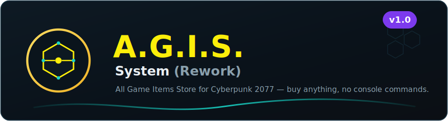

<div align="center">



### Buy (almost) **every in-game item** in [Cyberpunk 2077](https://www.cyberpunk.net) from immersive [Virtual Atelier](https://www.nexusmods.com/cyberpunk2077/mods/2987) shops — cyberware, weapons, quickhacks, clothing, mods & more.


**[Features](#features) · [Requirements](#requirements) · [Install](#installation) · [Credits](#credits) · [Deutsch](#deutsch)**

</div>

---

A cleaned-up, rebalanced and **unified** rework of **A.G.I.S. – All Game Items Store**. It merges the original **PUBLICNET**, **BLACKWALL** and **localisation** modules into a single mod, fixes prices and item categories, and plays nicely with **Atelier Price Fixer**.

> ⚠️ **All credit for the original mod goes to [Kryptolone](https://www.nexusmods.com/cyberpunk2077/mods/10909) on NexusMods.** This is an **unofficial** rework / maintenance version — the store concept, icon atlases and item lists are Kryptolone's work.

## Features

- **One mod instead of three** — PUBLICNET + BLACKWALL + localisation unified into a single package. Every file exists exactly once; no duplicate module or store definitions.
- **Consistent premium price balancing** — one deterministic rarity ladder (Common → Uncommon → Rare → Epic → Legendary = ×1 / ×2 / ×4 / ×8 / ×15) across the whole mod, instead of random or 0‑eddie prices. Tuned as a money‑sink economy.
- **Lore‑correct categories** — store names follow the official Cyberpunk 2077 cyberware slots: *Circulatory System*, *Integumentary System*, *Frontal Cortex*, *Operating System*, … (Data Inc. labelled as Quickhacks, EdgeNet as Quickhack Recipes, etc.).
- **Global price override (TweakXL)** — cyberware, quickhacks and iconic items get proper premium prices game‑wide via `agis_premium_prices.yaml` (Virtual Atelier cannot price these item types per‑store).
- **Atelier Price Fixer compatible** — every store carries ≥ 4 distinct prices, so APF auto‑skips them and the intended prices **and** item tiers show correctly.
- **Iconic items re‑sorted** into their correct categories (Johnny Silverhand's outfit → signature clothing store, quest masks → face accessories, iconic cyberware stays in the iconic‑cyberware store).

## Requirements

| Mod | |
|---|---|
| [Virtual Atelier](https://www.nexusmods.com/cyberpunk2077/mods/2987) | the shop framework |
| [ArchiveXL](https://www.nexusmods.com/cyberpunk2077/mods/4198) | |
| [Codeware](https://www.nexusmods.com/cyberpunk2077/mods/7780) | |
| [RED4ext](https://www.nexusmods.com/cyberpunk2077/mods/2380) | |
| [redscript](https://www.nexusmods.com/cyberpunk2077/mods/1511) | |
| [TweakXL](https://www.nexusmods.com/cyberpunk2077/mods/4197) | **required** for prices |
| [Atelier Price Fixer](https://www.nexusmods.com/cyberpunk2077/mods/28279) | *optional* — compatible; set `fixQualities` **off** for best results |

## Installation

1. Install every requirement listed above.
2. Download the archive from the [**Releases**](../../releases) page (or clone this repo).
3. Copy the `archive/` and `r6/` folders into your **Cyberpunk 2077 root folder**, or install the `.zip` with Vortex / your mod manager.
4. ⚠️ If you previously used the original A.G.I.S. mods (PUBLICNET / BLACKWALL / GERMAN localisation), **remove those first** — otherwise you get duplicate definitions and scripts won't compile.
5. Launch the game and open any Virtual Atelier terminal (or the phone app).

## Contents

```
archive/pc/mod/            icon atlases (PUBLICNET + BLACKWALL)
r6/scripts/…               43 redscript store definitions + localisation
r6/tweaks/…                agis_premium_prices.yaml (TweakXL price override)
```

## Credits

- **Original mod — A.G.I.S. – All Game Items Store:** **Kryptolone** (NexusMods) — all base content, store design, icon atlases and item lists: <https://www.nexusmods.com/cyberpunk2077/mods/10909>
- **Framework — Virtual Atelier:** keanuWheeze & contributors.
- **Rework:** maintained in this repository.

## License & Permissions

This is an **unofficial** rework distributed with full credit to the original author. Please respect the original mod's permissions on NexusMods. If the original author (Kryptolone) requests it, this repository will be taken down.

---

## Deutsch

**A.G.I.S. – System (Rework)** ist eine aufgeräumte, neu balancierte **Zusammenführung** von *A.G.I.S. – All Game Items Store* – einer [Virtual Atelier](https://www.nexusmods.com/cyberpunk2077/mods/2987)-Shop-Sammlung, mit der du in Cyberpunk 2077 (fast) **jedes Item** kaufen kannst.

- **Ein Mod statt drei** (PUBLICNET + BLACKWALL + Localisation vereint, keine Duplikate).
- **Einheitliches Premium-Balancing** – feste Preisleiter nach Seltenheit statt Zufalls-/0-Preisen.
- **Lore-korrekte Kategorien** (Circulatory/Integumentary System, Frontal Cortex, …).
- **Globaler TweakXL-Preis-Override** für Cyberware/Quickhacks/Iconics.
- **Kompatibel mit Atelier Price Fixer** (jeder Shop ≥ 4 verschiedene Preise → APF überspringt korrekt).

⚠️ Voraussetzung: **TweakXL**. Aller Verdienst am Original-Mod gebührt **Kryptolone** ([NexusMods](https://www.nexusmods.com/cyberpunk2077/mods/10909)). Dies ist ein inoffizielles Rework.
